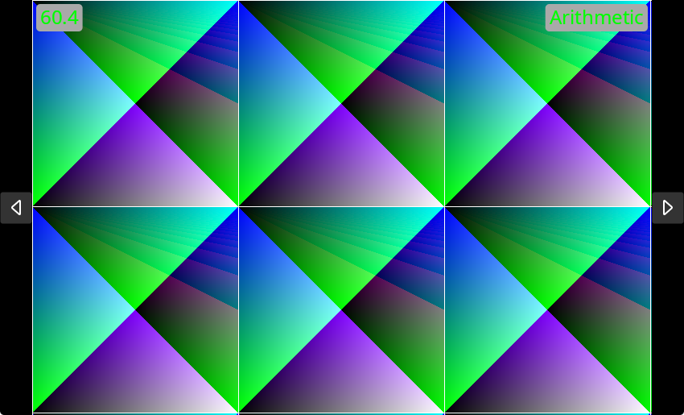
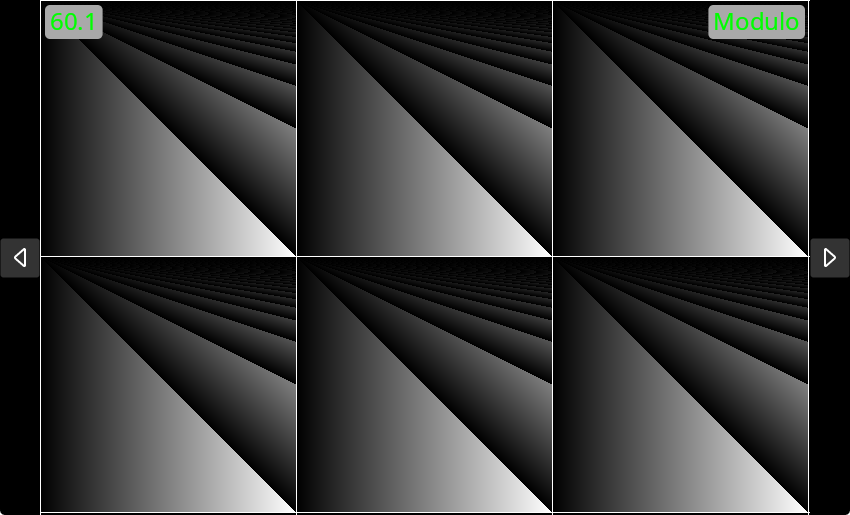

# Renderer

A small Avalonia + SkiaSharp playground for real-time 2D visualizers.

The app hosts multiple visualizer implementations and lets you switch between them at runtime.

## Features

- Real-time rendering on a Skia canvas inside Avalonia
- Multiple built-in visualizers (shader-style and animation-style)
- Simple next/previous navigation between visualizers (via the buttons or Left/Right arrow keys)
- Shared FPS and visualizer name overlay via a base class

## Getting Started

### Prerequisites

- .NET SDK 9.0+

### Run

```bash
dotnet restore
dotnet run --project Renderer/Renderer.csproj
```

## Project Structure

```text
Renderer/
  App.axaml(.cs)                App bootstrap
  MainWindow.axaml(.cs)         UI shell + visualizer registration
  Rendering/
    IVisualizer.cs              Visualizer contract
    VisualizerBase.cs           Common frame loop + FPS/name UI
    ShaderVisualizer.cs         Helper for tiled pixel-function shaders
    SkiaView.cs                 Visualizer host control + switching
    SkiaDrawOperation.cs        Avalonia -> Skia drawing bridge
  Visualizer/
    ArithmeticVisualizer.cs
    ModuloVisualizer.cs
    TrigonometryVisualizer.cs
    CircleVisualizer.cs
    BounceVisualizer.cs
```

## Built-in Visualizers

- `ArithmeticVisualizer`: shader pattern based on arithmetic operations on `(x, y)`.
- `ModuloVisualizer`: grayscale modulo-based shader pattern.
- `TrigonometryVisualizer`: color channels generated from `sin/cos/tan` formulas.
- `CircleVisualizer`: moving circle animation with dynamic radius.
- `BounceVisualizer`: bouncing ball animation with squash/stretch behavior.

### Arithmetic Visualizer



### Modulo Visualizer



### Trigonometry Visualizer


## How Visualizers Work

At a high level:

1. `SkiaView` keeps a list of `IVisualizer` instances.
2. On each render pass, `SkiaDrawOperation` acquires a Skia canvas from Avalonia.
3. The active visualizer draws into that canvas.
4. `VisualizerBase` provides shared behavior:
   - frame timing (`elapsedTicks`)
   - FPS calculation
   - small UI overlay (FPS + visualizer name)

You can implement `IVisualizer` directly, but most visualizers should inherit one of the provided base classes.

## Create Your Own Visualizer

There are two common paths.

### 1) Animation-style visualizer (`VisualizerBase`)

Use this for custom frame-by-frame drawing logic.

```csharp
using Avalonia;
using Renderer.Rendering;
using SkiaSharp;

namespace Renderer.Visualizer;

public class MyVisualizer() : VisualizerBase("My Visualizer")
{
    private readonly SKPaint _paint = new() { Color = SKColors.Orange, IsAntialias = true };
    private float _x;

    protected override void DrawFrame(SKCanvas canvas, Rect bounds, long elapsedTicks)
    {
        var dt = (float)elapsedTicks / TimeSpan.TicksPerSecond;
        _x += 200f * dt;
        if (_x > bounds.Width) _x = 0;

        canvas.DrawCircle(_x, (float)bounds.Center.Y, 30, _paint);
    }

    protected override void Dispose(bool disposing)
    {
        if (!disposing) return;
        _paint.Dispose();
    }
}
```

### 2) Shader-style visualizer (`ShaderVisualizer`)

Use this for effects defined by a pixel function `(x, y) -> color`.

```csharp
using Renderer.Rendering;
using SkiaSharp;

namespace Renderer.Visualizer;

public class MyShaderVisualizer() : ShaderVisualizer("My Shader", CalculatePixel)
{
    private static SKColor CalculatePixel(int x, int y)
    {
        return new SKColor(
            (byte)(x ^ y),
            (byte)((x * y) % 255),
            (byte)((x + y) % 255),
            255);
    }
}
```

### Register it in the app

Add your visualizer in `Renderer/MainWindow.axaml.cs`:

```csharp
_surface?.AddVisualizer(
    new ArithmeticVisualizer(),
    new BounceVisualizer(),
    new CircleVisualizer(),
    new ModuloVisualizer(),
    new TrigonometryVisualizer(),
    new MyVisualizer());
```

## Notes for Contributors

- Keep visualizers self-contained under `Renderer/Visualizer`.
- Dispose Skia resources (`SKPaint`, shaders, etc.) properly.
- Prefer `VisualizerBase` unless your effect is purely pixel-function based.